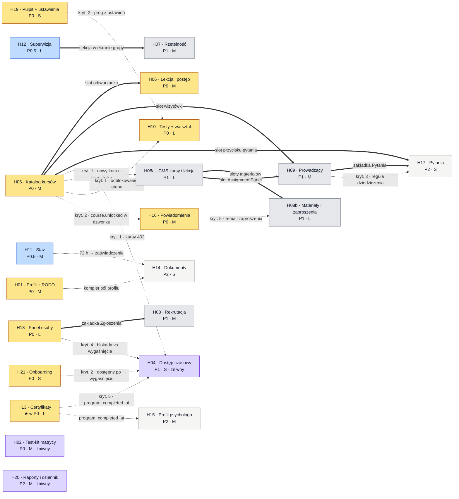
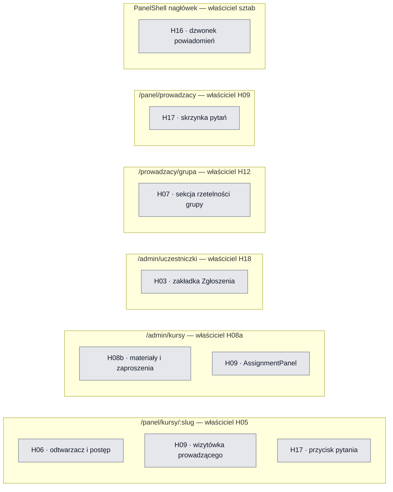
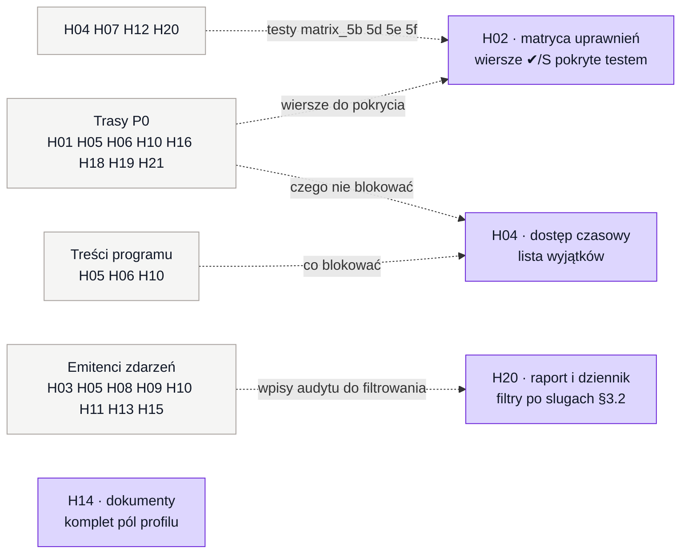
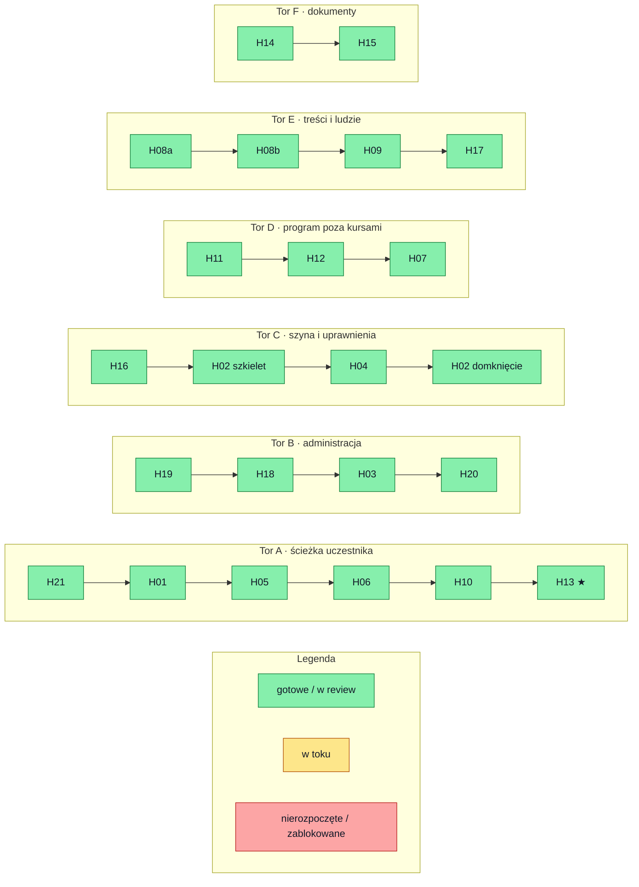
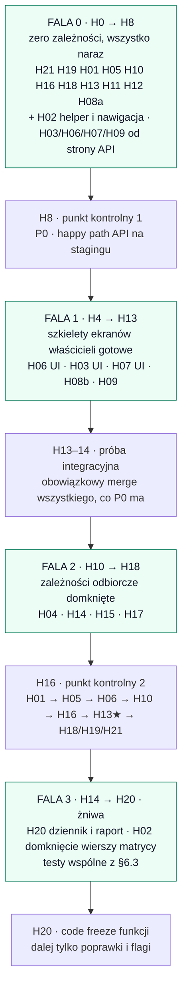

# Zależności pakietów H01–H21 i ścieżki dowożenia

Analiza pochodna: `01-pakiety-zadan.md` rozstrzyga zakres i kryteria odbioru,
`02-kontrakt-api.md` kształt HTTP, `00-przewodnik.md` §5.1 własność plików,
`04-seed-demo.md` stan danych. Ten dokument **nie zmienia** żadnego z nich — porządkuje
kolejność i pokazuje, co wolno robić równolegle.

## 1. Wniosek w jednym akapicie

**Prawie każdy pakiet można zacząć w godzinie H0.** Starter niesie komplet migracji,
seedy zgodne z `04-seed-demo.md` oraz fasady z zamrożonymi sygnaturami — więc pakiet,
który potrzebuje cudzych danych, czyta je z seedów albo z `ProgressAggregator`, a nie
z cudzego endpointu. Realne zależności są trzech rodzajów i tylko dwa pierwsze blokują:

| Rodzaj | Blokuje start? | Ile takich krawędzi |
|---|---|---|
| **Strukturalna** — mój ekran to slot/zakładka w cudzej stronie | tak, ale tylko UI (API robisz równolegle) | 8 |
| **Odbiorcza** — moje kryterium ★ wymaga cudzej trasy | nie blokuje pracy, blokuje **odbiór** | 12 |
| **Żniwna** — mój zakres rośnie w miarę, jak inni dowożą | nie | 4 pakiety |

Nie ma w programie ani jednej zależności typu „nie mogę napisać linijki, dopóki X nie
zmerguje". Wąskim gardłem jest **przepustowość review i integracji**, nie kolejność zadań.

## 2. Co starter już daje — i dlaczego to rozcina zależności

Zweryfikowane w kodzie na dzień pisania dokumentu:

| Element | Stan | Kogo odblokowuje |
|---|---|---|
| `app/Support/ProgressAggregator::for()` — sygnatura zamrożona, zwraca `courses_done/total`, `hours_accepted`, `supervision_present`, `workshop_done`, `reliability_percent` | gotowe | **H07, H13, H18, H19, H20** czytają jedną funkcję zamiast czekać na H05/H06/H10/H11/H12 |
| `app/Http/Middleware/EnsureAccessActive` (alias `access.active`) | gotowe, pełna reguła z `program_completed_at` | **H04** nie pisze bramki — podpina ją, dokłada `extend-access` i audyt |
| `app/Http/Middleware/EnsureRole` (alias `role:`) | gotowe | **H02** testuje istniejącą bramkę, nie buduje jej |
| `components/Forbidden.tsx` — ekran 403 z `reason.missing` | gotowe | **H02** podpina, **H05** używa przy `course_locked` |
| `components/layout/PanelShell.tsx` — dzwonek jako wyłączony placeholder w nagłówku | slot gotowy | **H16** wypełnia slot; plik należy do sztabu |
| `app/(uczestnik)/panel/start/page.tsx` | stub strony | **H21** startuje z gotowego ekranu |
| `config/public_routes.php` zawiera `api/v1/verify/*` | gotowe | **H13** ma publiczną trasę już przepuszczoną przez bramkę CI |
| `tests/Feature/PublicRoutesSmokeTest` | gotowe, bramka CI | potwierdza, że **H02 tego nie robi** (uwaga po recenzji w karcie H02) |
| `CourseAccess::state`, `Notify::send`, `AuditLog::record`, `Settings::edition`, `PdfService`, `Csv` | gotowe | wszyscy — reguły domenowe nie są przedmiotem negocjacji między zespołami |
| `routes/api/h01.php` … `h21.php` | **puste, same komentarze** | każdy pakiet startuje od zera tras — patrz §7, ryzyko dla H02 |
| `lib/menu/types.ts` — `MenuEntry` = `label`/`href`/`order` | **brak pola `roles`** | patrz §7, punkt koordynacyjny dla H02 |

## 3. Graf zależności

Strzałka biegnie **od dostawcy do odbiorcy**: `A ==> B` znaczy „B potrzebuje A".
Linia ciągła = zależność strukturalna (ekran/slot). Linia przerywana = zależność
odbiorcza (kryterium akceptacji drugiego pakietu).

Czego na grafie **nie ma**, choć intuicja podpowiada, że powinno:

- **H13 nie zależy od H10/H11/H12.** Kryterium ★ to ekran warunków liczony
  `ProgressAggregator` na seedach (marta 1/10 · 41,5/72 · 5/6 · warsztat NIE).
- **H07 nie zależy od H06.** Rzetelność liczy się z seedowanego `lesson_progress`
  (filip ≈15%, marta ≈85%).
- **H18/H19/H20 nie zależą od pakietów produkujących liczby.** Wszystkie trzy czytają
  ten sam agregator, a wartości docelowe stoją w `04-seed-demo.md` §5.
- **H05 nie zależy od H10.** Kryterium 3 używa komendy `demo:pass-test` ze startera.
- **H03 nie zależy od startera w zakresie aktywacji konta** — `POST /auth/activate`
  jest już zaimplementowane.

## 4. Mapa własności ekranów i slotów

Jedyne miejsca, w których dwa zespoły dotykają tej samej strony. Właściciel dowozi
szkielet z pustymi slotami **w pierwszej kolejności** — to jego zobowiązanie wobec
pozostałych, nie miła opcja.

Pliki rozdzielone z góry i **bezkolizyjne**: `routes/api/hXX.php` (jeden na pakiet),
pozycje menu (`lib/menu/<panel>/hXX-*.ts`, jeden plik na pakiet — dopisujesz tylko
dwie linie w `index.ts`), `DEMO/HXX.md`, seeder per pakiet z własnym zakresem ID.

## 5. Pakiety niezależne — trzy klasy

### 5a. W pełni niezależne (własne tabele, własne ekrany, wejścia z seedów)

Można rozdać jednocześnie w H0, żadna para nie czeka na drugą.

| Pakiet | Prio | Własne ekrany | Skąd bierze wejście |
|---|---|---|---|
| H21 Onboarding | P0 · S | `/panel/start` | tabela `settings` |
| H19 Pulpit i ustawienia | P0 · S | `/admin`, `/admin/ustawienia` | `editions` + agregator |
| H01 Profil i RODO | P0 · M | `/panel/profil` | `users`, `consents` |
| H05 Katalog kursów | P0 · M | `/panel/kursy`, `/panel/kursy/:slug` | `CourseAccess::state` |
| H10 Testy i warsztat | P0 · L | `/panel/kursy/:slug/test` | bank pytań z seedów |
| H16 Powiadomienia | P0 · M | `/admin/emails` + slot dzwonka | `Notify::send`, rejestr §3.1 |
| H18 Panel osoby | P0 · L | `/admin/uczestniczki` + karta | agregator + seedy |
| H13 Certyfikaty | ★ P0 · L | `/panel/certyfikat`, `/weryfikacja` | agregator, `PdfService` |
| H11 Staż | P0.5 · M | `/panel/staz`, `/admin/staz` | `internship_entries` |
| H12 Superwizja | P0.5 · L | `/panel/superwizja`, `/prowadzacy/grupa` | własne tabele |
| H08a CMS kursów | P1 · L | `/admin/kursy` | `courses`, `lessons` |
| H15 Profil psychologa | P2 · M | `/panel/profil-psychologa`, `/admin/profile` | `program_completed_at` oli z seedów |

### 5b. Niezależne po stronie API, zależne po stronie UI

Backend startuje w H0 razem z resztą; frontend czeka wyłącznie na szkielet cudzej strony.

| Pakiet | UI czeka na | Co robić w międzyczasie |
|---|---|---|
| H06 Lekcja | slot w stronie kursu (H05) | endpointy `progress`/`complete` + testy przycinania `active_delta` |
| H03 Rekrutacja | zakładka w `/admin/uczestniczki` (H18) | cały przepływ akceptacji, import CSV, `sensitive_access_log` |
| H07 Rzetelność | sekcja w `/prowadzacy/grupa` (H12) | `/admin/reliability` + własny ekran `/admin/czas-nauki` |
| H08b Materiały | sloty w `/admin/kursy` (H08a) | upload, walidacja typu i rozmiaru, podpisane linki |
| H09 Prowadzący | sloty w H05 i H08a | `/instructors`, reguła dziedziczenia, przypisania |
| H17 Pytania | sloty w H05 i H09 | routing pytań wg dziedziczenia + testy izolacji |

### 5c. Pakiety żniwne — zakres rośnie wraz z resztą programu

Nie blokują nikogo i nikt nie blokuje ich startu, ale **ich odbiór dojrzewa późno**.
Dla nich planuje się dwa wejścia: wcześniejszy szkielet i późniejsze domknięcie.

## 6. Ścieżki dowożenia

### 6.1 Sześć torów

Tor = ciąg pakietów, w którym każdy kolejny korzysta z ekranu poprzedniego. Tory biegną
**równolegle względem siebie** — nie ma między nimi krawędzi strukturalnych.

Stan wg `openspec/changes/koordynacja-pakietow-h01-h21/tasks.md` (2026-08-28, po scaleniu H20,
H17, H09, H07 i H08): `DONE`/`REVIEW` → zielony, `W TOKU` → żółty, `GOTOWE` (nieodebrany) i
`BLOCKED` → czerwony. Wszystkie sześć torów jest zielonych — każdy pakiet H01–H21 jest scalony
albo czeka na review. Otwarte pozostają bramki kontraktowe K1–K12 dla H08 i H09; nie zmieniają
kolorów, bo dotyczą potwierdzenia tras, nie dowiezienia zakresu.

Uwaga do torów A i E: strzałka `H21 → H01 → H05` nie jest blokadą techniczną, tylko
**kolejnością zwrotu z inwestycji** — H21 i H19 to pakiety S, dowożone w kilka godzin,
i dają wczesne „coś działa na stagingu" wymagane na sanity kontraktu w H5.
W torze E `H08b → H09` też nie jest blokadą — oba czekają wyłącznie na `#/admin/kursy`.

### 6.2 Fale względem punktów kontrolnych z przewodnika §7

### 6.3 Testy wspólne — handshake między pakietami

Kryteria, których **żaden pakiet nie zamknie sam**. Właściciel testu = pakiet dowożony
później; obie strony wpisują wynik do swojego `DEMO/HXX.md`.

| Test | Pakiety | Treść |
|---|---|---|
| odblokowanie etapu | H10 + H05 | zaliczenie testu kursu 2 przestawia kurs 3 na `in_progress` |
| próg z ustawień | H19 + H10 | zmiana `test_pass_threshold` zmienia próg bez deployu |
| dzwonek w happy path | H05 + H16 | `course.unlocked` widoczny w dzwonku, bez oblewania suity |
| wygaśnięcie dostępu | H04 + H05/H01/H21 | kursy 403 `access_expired`; logowanie, profil, eksport i onboarding działają |
| bezterminowy dostęp | H04 + H13 | `program_completed_at` zdejmuje limit |
| blokada vs wygaśnięcie | H04 + H18 | zablokowany dostaje inny komunikat niż ten z wygasłym dostępem |
| reguła dziedziczenia | H09 + H17 | pytanie trafia do prowadzącego lekcji, w razie braku — kursu |
| zgodność liczb | H13 + H18 + H19 + H20 | ta sama liczba w warunkach, karcie osoby, pulpicie i raporcie |
| przypisanie superwizora | H12 + H18 | `PUT /admin/users/{id}/supervisor` + audyt `supervisor.assigned` |
| nowy kurs z panelu | H08a + H05 | kurs założony w CMS widoczny u uczestnika bez zmian w kodzie |
| e-mail zaproszenia | H08b + H16 | zaproszenie tworzy powiadomienie i rekord w skrzynce `simulated` |
| matryca uprawnień | H02 + każdy pakiet z trasami | wiersz ✔/S ma test pozytywny i negatywny |

### 6.4 Kolejność przy niepełnej obsadzie

Gdyby torów nie dało się prowadzić równolegle, priorytet ma ciąg dający najwięcej
odblokowań na godzinę pracy:

1. **H05** — odblokowuje H06, H09, H17 oraz kryteria H04, H08a, H10, H16. Największy
   mnożnik w całym programie.
2. **H18** — odblokowuje H03 i domyka handshake z H04 oraz H12.
3. **H12** — odblokowuje H07.
4. **H08a** — odblokowuje H08b i H09.
5. **H09** — odblokowuje H17.
6. **H16** — nie odblokowuje nikogo strukturalnie, ale bez niego pięć pakietów nie ma
   jak pokazać swoich powiadomień na demo.

Pakiety, które można ściąć bez efektu domina: **H14, H15, H17, H20, H07** — nikt na nich
nie stoi. Pakiet, którego ścięcie boli najbardziej: **H05**.

## 7. Punkty koordynacyjne wykryte w kodzie

Rzeczy do zgłoszenia sztabowi **przed** rozpoczęciem pakietu, nie w trakcie review.

| # | Ustalenie | Kogo dotyczy | Do kogo |
|---|---|---|---|
| 1 | `lib/menu/types.ts` — `MenuEntry` ma tylko `label`/`href`/`order`, **nie ma pola `roles`**. Nawigacja wg roli z zakresu H02 wymaga albo rozszerzenia typu w rejestrze (plik sztabu), albo osobnej warstwy filtrującej po stronie H02. | H02, pośrednio wszyscy dokładający pozycje menu | sztab, właściciel rejestru menu |
| 2 | Wszystkie `routes/api/hXX.php` są puste. Kryterium H02 nr 1 („≥40 asercji **na trasach P0**, zielone") nie ma dziś czego dotknąć poza `/me` i `/auth/*`. Trzeba z góry ustalić, czy wiersze bez trasy są `skipped`, czy sprawdzane na trasie syntetycznej z tym samym stosem middleware. | H02 | liaison H02 |
| 3 | `UserResource` i kształt `/me` należą do sztabu. H01 rozszerza go o PESEL, adres, telefon, `product_group` — **zgłoszenie przez issue, nie PR w pliku sztabu**. | H01, pośrednio H14 i H18 | sztab |
| 4 | Dzwonek w `PanelShell` to dziś wyłączony przycisk w pliku sztabu. H16 musi ustalić, czy sztab podmienia go na slot, czy H16 dostaje jednorazową zgodę na edycję pliku. | H16 | sztab |
| 5 | `PUT /admin/users/{id}/supervisor` widnieje w kontrakcie pod H12 i H18 jednocześnie. Jeden zespół implementuje, drugi tylko konsumuje. | H12, H18 | strażnik kontraktu |
| 6 | Ekran `/admin/uczestniczki` ma dwóch wnioskodawców: H18 (lista i karta) oraz H03 (zakładka „Zgłoszenia"). Właścicielem jest H18. | H18, H03 | liaison |
| 7 | H04 nie pisze middleware — `EnsureAccessActive` jest gotowe i kompletne. Zakres H04 to **lista wyjątków** (które trasy dostają `access.active`), `extend-access`, audyt i zadanie cykliczne. Lista wyjątków dotyka tras H01, H21, H13 — uzgadniana, nie ustalana jednostronnie. | H04, H01, H21, H13 | strażnik kontraktu |
| 8 | H02 **nie** odpowiada za smoke-test autoryzacji tras — `tests/Feature/PublicRoutesSmokeTest` jest bramką CI ze startera. | H02 | — |

## 8. Ściąga — jedna tabela na wszystko

Legenda: **Start** = czy można zacząć w H0 · **UI czeka na** = strukturalna blokada
frontu · **Odbiór czeka na** = pakiety potrzebne, żeby domknąć kryteria.

| Pakiet | Prio | Rozm. | Start | UI czeka na | Odbiór czeka na | Kogo odblokowuje |
|---|---|---|:--:|---|---|---|
| H01 Profil i RODO | P0 | M | ✔ | — | — | H14 |
| H02 Test-kit matrycy | P0 | M | ✔ | — | wszyscy z trasami | — |
| H03 Rekrutacja | P1 | M | ✔ API | H18 | H16 | — |
| H04 Dostęp czasowy | P1 | S | ✔ | — | H05, H01, H21, H13, H18 | — |
| H05 Katalog kursów | P0 | M | ✔ | — | — | **H06, H09, H17, H04, H08a, H10, H16** |
| H06 Lekcja | P0 | M | ✔ API | H05 | H19 | — |
| H07 Rzetelność | P1 | M | ✔ API | H12 | H19 | — |
| H08a CMS kursów | P1 | L | ✔ | — | H05 | **H08b, H09** |
| H08b Materiały | P1 | L | ✔ API | H08a | H05, H16 | — |
| H09 Prowadzący | P1 | M | ✔ API | H05, H08a | — | **H17** |
| H10 Testy i warsztat | P0 | L | ✔ | — | H05, H19 | H13 |
| H11 Staż | P0.5 | M | ✔ | — | H16 | H14 |
| H12 Superwizja | P0.5 | L | ✔ | — | H18 | **H07** |
| H13 Certyfikaty | ★P0 | L | ✔ | — | — | H04, H15 |
| H14 Dokumenty | P2 | S | ✔ | — | H01, H11 | — |
| H15 Profil psychologa | P2 | M | ✔ | — | H13, H16 | — |
| H16 Powiadomienia | P0 | M | ✔ | slot sztabu | H05 | pięć pakietów na demo |
| H17 Pytania | P2 | S | ✔ API | H05, H09 | H09, H16 | — |
| H18 Panel osoby | P0 | L | ✔ | — | H04, H12 | **H03** |
| H19 Pulpit i ustawienia | P0 | S | ✔ | — | H10 | — |
| H20 Raporty i dziennik | P2 | M | ✔ | — | emitenci audytu | — |
| H21 Onboarding | P0 | S | ✔ | — | H04 | — |

---

Rozjazd między tym dokumentem a `01-pakiety-zadan.md` rozstrzyga się **na korzyść karty
pakietu** — tutaj opisana jest kolejność, tam zakres i kryteria odbioru.
